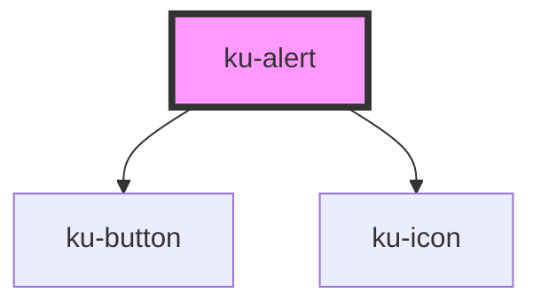

# ku-alert

<!-- Auto Generated Below -->

## Properties

| Property   | Attribute  | Description | Type                                                                      | Default     |
| ---------- | ---------- | ----------- | ------------------------------------------------------------------------- | ----------- |
| `closable` | `closable` |             | `boolean`                                                                 | `false`     |
| `duration` | `duration` |             | `number`                                                                  | `0`         |
| `open`     | `open`     |             | `boolean`                                                                 | `false`     |
| `variant`  | `variant`  |             | `"accent" \| "alert" \| "error" \| "primary" \| "secondary" \| "success"` | `'primary'` |

## Events

| Event          | Description | Type                |
| -------------- | ----------- | ------------------- |
| `alert.hidden` |             | `CustomEvent<void>` |
| `alert.hide`   |             | `CustomEvent<void>` |
| `alert.show`   |             | `CustomEvent<void>` |
| `alert.shown`  |             | `CustomEvent<void>` |

## Methods

### `hide() => Promise<void>`

#### Returns

Type: `Promise<void>`

### `show() => Promise<void>`

#### Returns

Type: `Promise<void>`

### `toast() => Promise<void>`

#### Returns

Type: `Promise<void>`

## Shadow Parts

| Part        | Description |
| ----------- | ----------- |
| `"base"`    |             |
| `"icon"`    |             |
| `"message"` |             |

## Dependencies

### Depends on

- [ku-button](../ku-button)
- [ku-icon](../ku-icon)

### Graph

----------------------------------------------

*Built with [StencilJS](https://stenciljs.com/)*
