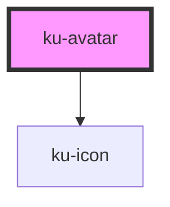

# ku-avatar

<!-- Auto Generated Below -->

## Properties

| Property   | Attribute  | Description                         | Type                                | Default         |
| ---------- | ---------- | ----------------------------------- | ----------------------------------- | --------------- |
| `height`   | `height`   |                                     | `string`                            | `'3rem'`        |
| `icon`     | `icon`     |                                     | `string`                            | `'person-fill'` |
| `initials` | `initials` | First letter of first and last name | `any`                               | `null`          |
| `shape`    | `shape`    |                                     | `"circle" \| "rounded" \| "square"` | `'circle'`      |
| `src`      | `src`      |                                     | `any`                               | `null`          |
| `width`    | `width`    |                                     | `string`                            | `'3rem'`        |

## Shadow Parts

| Part         | Description |
| ------------ | ----------- |
| `"icon"`     |             |
| `"initials"` |             |

## CSS Custom Properties

| Name           | Description             |
| -------------- | ----------------------- |
| `--background` | Background of the toast |

## Dependencies

### Depends on

- [ku-icon](../ku-icon)

### Graph

----------------------------------------------

*Built with [StencilJS](https://stenciljs.com/)*
