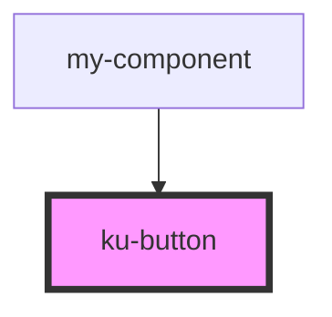

# ku-button

<!-- Auto Generated Below -->

## Properties

| Property   | Attribute  | Description | Type                                         | Default     |
| ---------- | ---------- | ----------- | -------------------------------------------- | ----------- |
| `color`    | `color`    |             | `"accent" \| "primary" \| "secondary"`       | `'primary'` |
| `disabled` | `disabled` |             | `boolean`                                    | `undefined` |
| `fluid`    | `fluid`    |             | `boolean`                                    | `false`     |
| `href`     | `href`     |             | `string`                                     | `undefined` |
| `loading`  | `loading`  |             | `boolean`                                    | `false`     |
| `type`     | `type`     |             | `"button" \| "submit"`                       | `'button'`  |
| `variant`  | `variant`  |             | `"flat" \| "ghost" \| "outline" \| "raised"` | `'ghost'`   |

## Dependencies

### Used by

 - [my-component](../my-component)

### Graph

----------------------------------------------

*Built with [StencilJS](https://stenciljs.com/)*
