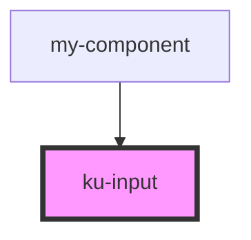

# ku-input

<!-- Auto Generated Below -->

## Properties

| Property       | Attribute       | Description | Type                                 | Default     |
| -------------- | --------------- | ----------- | ------------------------------------ | ----------- |
| `classes`      | `classes`       |             | `string`                             | `undefined` |
| `defaultValue` | `default-value` |             | `string`                             | `undefined` |
| `placeholder`  | `placeholder`   |             | `string`                             | `undefined` |
| `required`     | `required`      |             | `boolean`                            | `undefined` |
| `type`         | `type`          |             | `"email" \| "password" \| "text"`    | `"text"`    |
| `value`        | `value`         |             | `string`                             | `null`      |
| `variant`      | `variant`       |             | `"floated" \| "legacy" \| "rounded"` | `'legacy'`  |

## Dependencies

### Used by

 - [my-component](../my-component)

### Graph

----------------------------------------------

*Built with [StencilJS](https://stenciljs.com/)*
